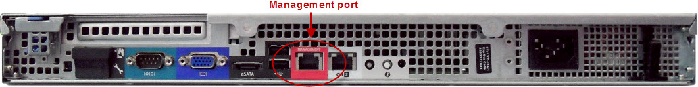
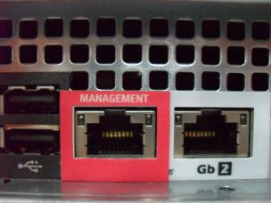
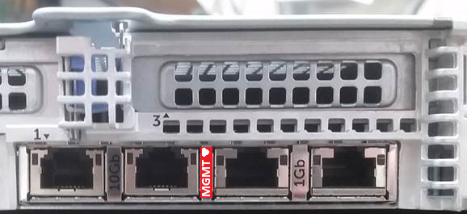
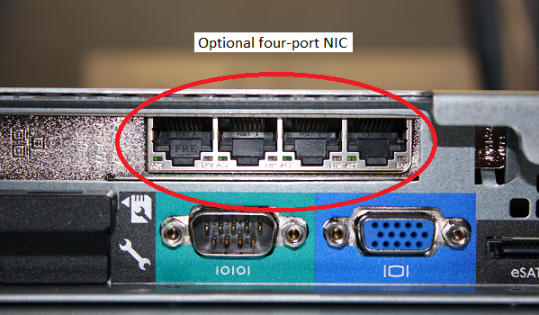
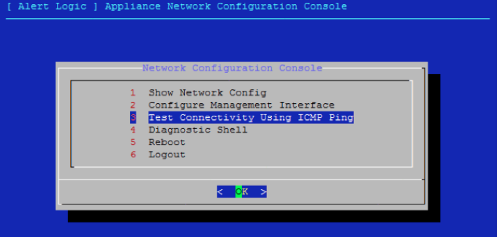
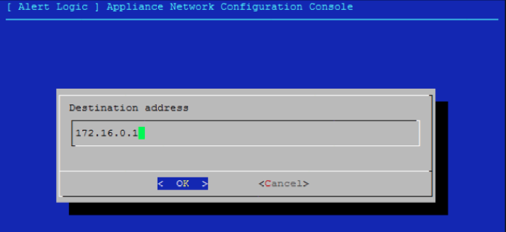

# Install and Configure the  Physical Appliance

The Alert Logic physical appliance is a server that is preconfigured by Alert Logic to collect IDS data and provide Alert Logic Managed Web Application Firewall (WAF) services. Alert Logic offers two physical appliances—the Dell PowerEdge R240 and the Dell PowerEdge R640. You can use this document for either physical appliance.

Your conversations with Alert Logic representatives determine which physical appliance corresponds with your Alert Logic subscription level and best serves the goals of your organization. In general, however, the following applies:

* The Alert Logic MDR Essentials subscription requires the R240 Dell appliance.
* Alert Logic MDR Professional and Alert Logic MDR Enterprise subscriptions require the R640 Dell appliance.

You can find the technical specifications for both servers at the following locations on the Dell website:

* [Dell PowerEdge R240 Technical Guide](https://i.dell.com/sites/csdocuments/Product_Docs/en/poweredge-r240-technical-guide.pdf)
* [Dell PowerEdge R640 Technical Guide](https://i.dell.com/sites/csdocuments/Shared-Content_data-Sheets_Documents/en/us/PowerEdge-R640-Technical-Guide.pdf)

Your discussions with Alert Logic determined whether your level of service requires the Dell PowerEdge R240 or the Dell PowerEdge R640 physical appliance. For more information about how to connect the physical appliance to your network, review the Dell hardware documentation for the [Dell PowerEdge R240](https://topics-cdn.dell.com/pdf/poweredge-r240_owners-manual_en-us.pdf) or the [Dell PowerEdge R640](https://topics-cdn.dell.com/pdf/poweredge-r640_owners-manual_en-us.pdf) appliance.

Data Center deployments only

For Data Center deployments, you must locate and copy your **Unique Registration Key**, which you need to install the appliance.

Alert Logic uses the Unique Registration Key to specify where the appliance is located.

To access your Unique Registration Key:

1. In the Alert Logic console, open the relevant Data Center deployment.
2. Under **Configuration Overview**, click **Installation Instructions**.
3. Copy your Unique Registration Key.

## Management port

Alert Logic ships the appliance with an Ethernet management port, framed in red, which comes preconfigured with the IP address for your physical appliance.

The images below display the management port for the Dell PowerEdge R240.

The image below displays the management port for the Dell PowerEdge R640.

## NIC for additional network ports 

This optional NIC provides up to four additional network monitoring ports. During the onboarding process, Alert Logic requests the number of ports you require for your network. If you require additional network ports, Alert Logic orders and installs the appropriate NIC.

## Install the physical appliance

Review the Dell hardware documentation for the [Dell PowerEdge R240](https://topics-cdn.dell.com/pdf/poweredge-r240_owners-manual_en-us.pdf) or the [Dell PowerEdge R640](https://topics-cdn.dell.com/pdf/poweredge-r640_owners-manual_en-us.pdf) appliance for additional information about how to connect the physical appliance to your network.

**To install the  physical appliance:**

1. Use the enclosed installation instructions to properly mount the appliance in the rack.
2. Use the ports on the back panel to connect the appliance to your network.
3. Connect a network cable from the red Ethernet management port on the appliance to the switch port and VLAN associated with the IP address allocated for the appliance.
4. Connect the network cable   from the appliance monitor ports to the switch ports or network taps. The number and media type of monitor ports vary based on  deployment.				
With the exception of the red Ethernet management port, any  Ethernet port may be used as a monitor port.
5. Connect to a power source, and then press the power button.
6. Contact the Alert Logic Security Operations Center (SOC) to request a connectivity test.
   * In the US, call (877) 484-8383, and then select option 2.
   * In the EU, call +44 (0) 203 011 5533, and then select option 2.

    Alert Logic  ships appliances with a preconfigured network IP address. If you need to change the appliance IP address, you can work with Technical Support to do so at the start of this call. For more information, see [Change the IP Address of a Physical Appliance](physical-appliance-change-ip.md).    ## Test the network configuration

Your Alert Logic representative will work through the network configuration test with you using the following procedure.

To test the network configuration:

1. From the Network Configuration Console, select **Test Connectivity Using ICMP Ping**.

> 

1. Enter the IP address of the default gateway.

> 

If you do not see a succession of ping responses, the connectivity test cannot ping the default gateway. Verify that the red Ethernet management port on the appliance is connected to the correct VLAN port, and that your IP information is correct.

1. After you ping the default gateway successfully, send an email to [Alert Logic Onboarding](mailto:onboarding@alertlogic.com).  Provide the IP address of your appliance, or the NAT address if you use a separate internal and external addressing scheme.
