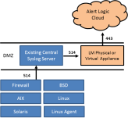
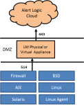

# How to collect syslog for an appliance without the agent

Syslog forwarding is used to send log messages to the Alert Logic Log Manager. The device is then listed on the **Sources** screen under **Collection** in the Alert Logic console.

**Consider the following scenarios: **

    Existing central syslog server    
If you already have a central syslog server, you can forward syslog traffic to a virtual appliance or a physical appliance.

The image below summarizes how logs are collected with an existing central syslog server.

    New central syslog server    
If you don't have a central syslog server already established or you wish to have a separate collection path, you can install  either a virtual appliance or a physical appliance and send syslog traffic directly to the appliance.

The image below summarizes how logs are collected without a central syslog server.

## Configure syslog for agentless collection

    How to configure syslog    
The Alert Logic Log Manager appliance listens for syslog data on TCP and UDP port 514. The appliance will process any syslog traffic directed to the local IP address of your appliance.

The following examples apply to common Linux and Unix syslog daemons.

**To configure Rsyslog (RedHat Enterprise Linux, Fedora, etc.):**

1. Add a line to /etc/rsyslog.conf
   * For TCP collection: <kbd>*.* @@IP of sensor: 514</kbd>
   * For UDP collection: <kbd>*.* @IP of sensor: 514</kbd>
3. Restart rsyslog: <kbd>/etc/init.d/rsyslog restart</kbd>

**To configure Syslogd (Solaris, legacy Unix):**

1. Add a line to /etc/syslog.conf: <kbd>*.debug @IP of sensor</kbd>
2. Restart syslog with one of the following commands:
   * <kbd>svcadm restart svc:/system/system-log:default</kbd>
   * <kbd>/etc/init.d/syslog restart</kbd>

## Download and install a remote collector for agentless collection

The instructions for installing and downloading a remote collector vary based on the operating system in use.

* [Install the  Remote Collector for Linux](remote-log-collector-linux.md)
* [Install the Remote Collector for Windows](remote-log-collector-windows.md)
