## Change the IP Address of a Physical Appliance

Alert Logic ships appliances with a preconfigured network IP address. If you need to add or update an appliance IP address, you must use the network configuration utility Alert Logic provides for this purpose. Alert Logic suggests you contact Technical Support for guidance:

* In the US, call (877) 484-8383, and then select option 2.
* In the EU, call +44 (0) 203 011 5533, and then select option 2.

To access the network configuration utility on the appliance, you must connect either of the following devices to the appliance:

* A USB keyboard and monitor connected to a USB connector and the VGA connector on the appliance.
* An IP-based KVM attached to the appliance.

    To complete the IP configuration procedure, make sure that the only network cable connected to the appliance is to the red Management port. Disconnect any Ethernet cables connected to other ports before you begin. Reconnect any disconnected cables after you complete the procedure.                
**To configure the network:**

1. Turn on the appliance.
2. At the login prompt, use the login name **setup** and the password provided by Alert Logic.

If you already powered on the appliance, press the space bar for the login prompt. 1. In the Configuration Utility, select **Network Configuration**, and then press **Enter.**

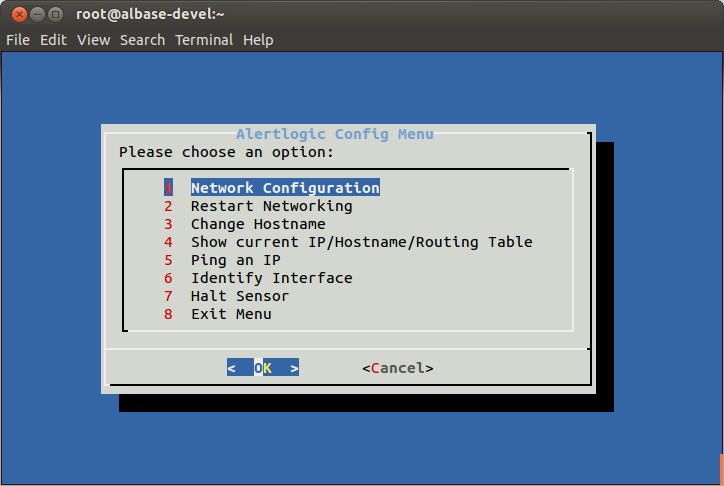

1. Review the instructions, and then press **Enter**.

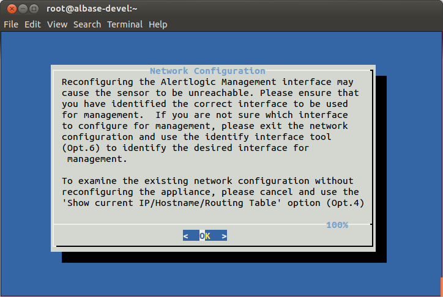

1. Press **Enter** to continue.

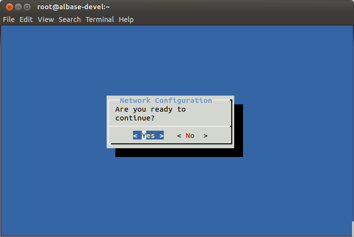

1. On the Interfaces screen, press **Enter** to continue.

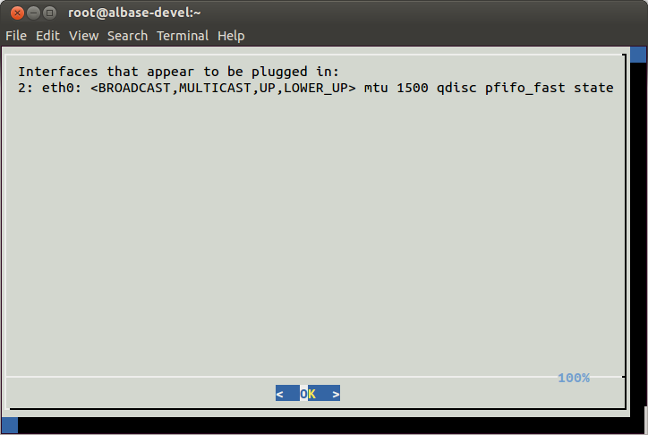

The Interfaces screen displays the connected interfaces. Typically, eth0 is the management interface as designated on the back of the sensor. However, other configurations could require management on a different interface.

1. Select the desired management interface, and then press **Enter**.

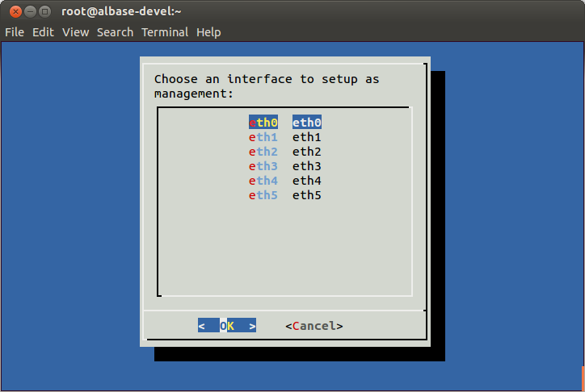

1. Provide the IP address default gateway and subnet mask. Use the arrow keys to switch between fields. 
**Optional:** Provide two DNS server IPs that the appliance can use instead of the default Google DNS servers.

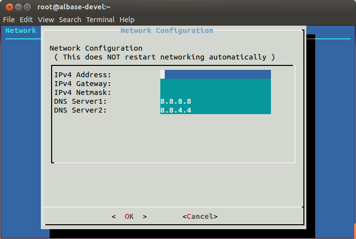

1. Press **Enter**.
2. Press **Enter** to confirm configuration.

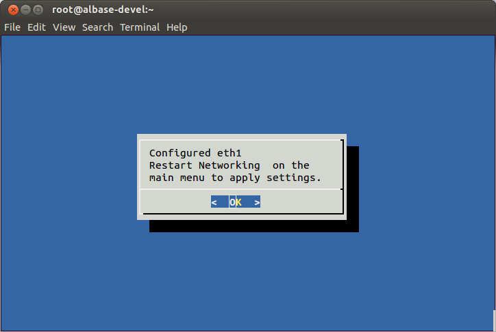

1. Reconnect any network cables that you previously disconnected.

**To apply network changes:**

1. From the Main Menu, select **Restart Networking**, and then press **Enter** to apply the configuration changes performed in the previous section.

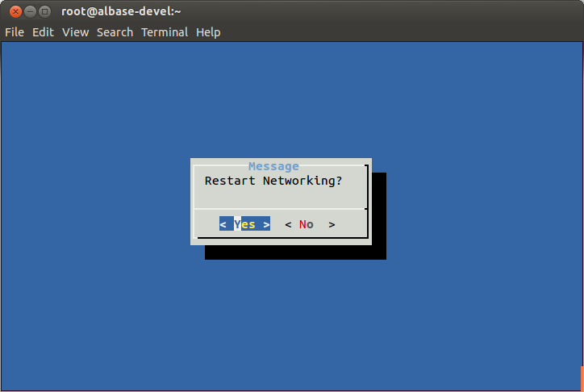

1. Select **Show Current IP/Hostname/Routing Table** to see the changed interface and IP configuration.

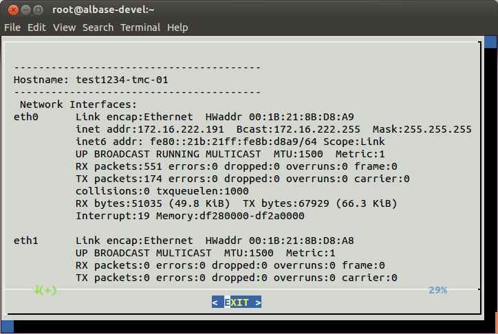

The configured Default Gateway appears with a destination of <kbd>0.0.0.0</kbd>, a flag of <kbd>UG</kbd>, and your enterprise default gateway.

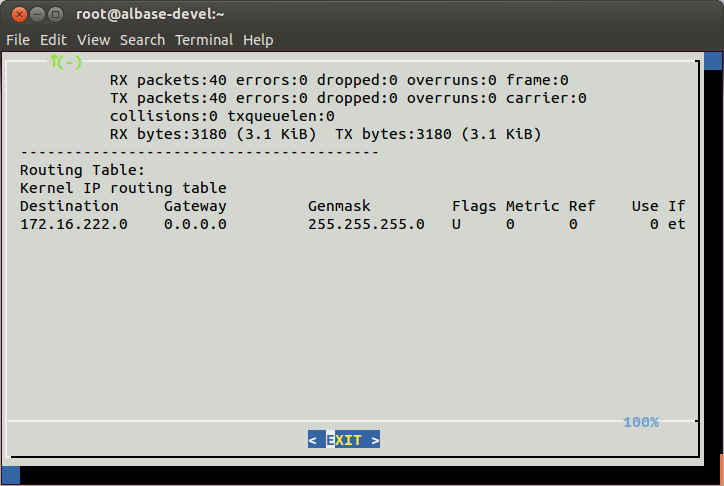

You can contact Alert Logic   to verify connectivity with the appliance. The appliance should be reachable on your local network.

**Confirm communication ability:**

You can perform this optional procedure to verify the physical appliance can communicate with other IP addresses.

1. From the main menu, select **Ping an IP**, and then press **Enter**.
2. Provide an IP address in the form provided, and then press **Enter**.

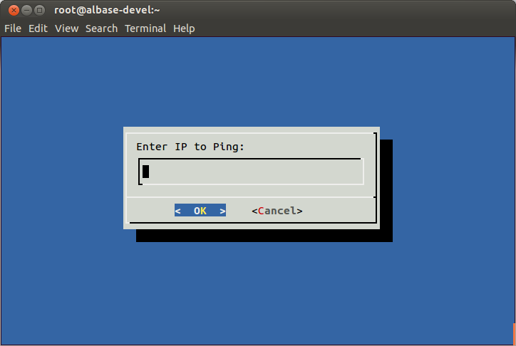

1. After you verify communication with the IP address,  press **Enter**.

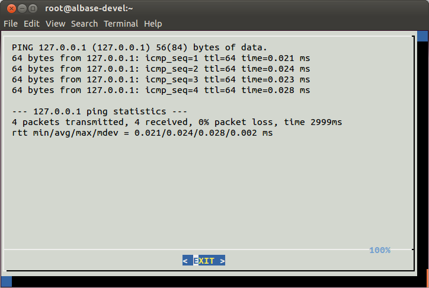

Identify Interfaces

The Identify Interfaces tool flashes the Link LED of a selected detected interface to assist you with cabling and connections.

**To identify interfaces:**

1. From the Main Menu, select **Identify Interface**, review the instructions, and then press **Enter**.

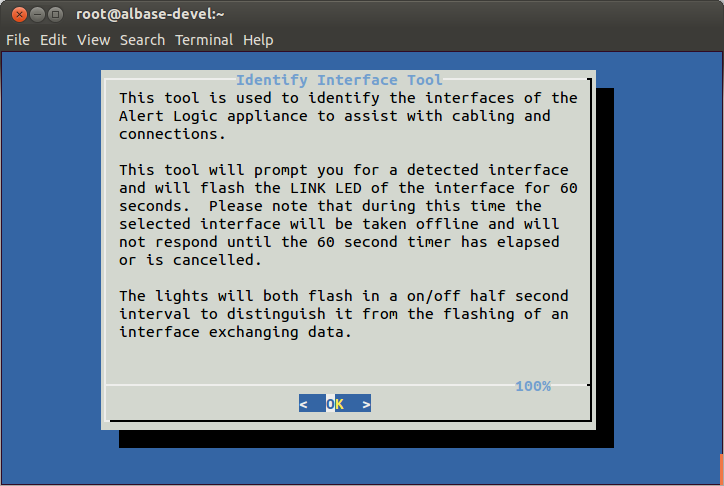

1. To continue, press **Enter**.

1. Select the interface to identify, and then press **Enter**.

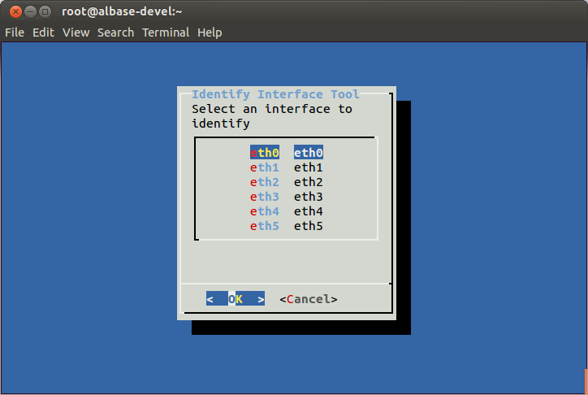
