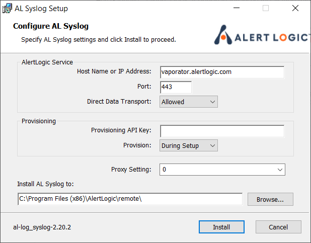

# Install the Remote Collector for Windows

A remote collector collects, compresses, and encrypts log data from the configured remote machines to send directly to Alert Logic. For more information on the system requirements for a remote collector, see [Requirements for the Alert Logic Remote Collector](../requirements/remote-collector.md).

Remote collectors only support syslog collection.

A remote collector is useful because:

* A remote collector can be installed on a Windows machine or a Linux machine.
* A remote collector can be upgraded remotely.
* A remote collector does not require a virtual VMware instance, unlike a virtual appliance.
* Hosts without an agent can send syslog data to Alert Logic via a remote collector.
* Log status is reported directly to Alert Logic.

Data Center deployments only

For Data Center deployments, you must locate and copy your **Unique Registration Key**, which you need to install the remote collector.

Alert Logic uses the Unique Registration Key to specify where the remote collector is located.

To access your Unique Registration Key:

1. In the Alert Logic console, open the relevant Data Center deployment.
2. Under **Configuration Overview**, click **Installation Instructions**.
3. Copy your Unique Registration Key.

You can install the Alert Logic universal agent and syslog remote collector on the same host. This will allow the syslog remote collector to collect forwarded logs, while the universal agent collects local logs and network traffic for Network IDS and audit purposes. This setup ensures that the syslog remote collector host is protected the same way as all your other assets in a deployment.

After you install the syslog remote collector, you must adjust Windows Firewall settings to allow incoming connections on the port specified in the default syslog remote collector policy (or a custom syslog policy attached to the remote collector). Alert Logic recommends restricting these policies to allow connections only from specific hosts or private networks.

## Download a remote collector 

To download the remote collector, click a link in the table:

| Format | Link |
|---|---|
| MSI | [Latest syslog remote collector (.msi)](https://scc.alertlogic.net/software/al_log_syslog-LATEST.msi) |
| ZIP | [Latest syslog remote collector (.zip)](https://scc.alertlogic.net/software/al_log_syslog-LATEST.zip) |

## Install a remote collector

### Install via the GUI

1. Copy the MSI package to the target machine.
2. Run the MSI package.

1. For AWS and Azure deployments, leave the **Provisioning API Key** field blank. For Data Center deployments, paste your **Unique Registration Key** in the **Provisioning API Key** field.
2. Click **Install**.

### Install via the command prompt

To install remote collector:

1. Copy the MSI package to the target machine.
2. Run MsiExec.exe, a Windows MSI package installer, with the following command-line parameter: <kbd>/i [path]al_log_syslog-[version]-[type].msi</kbd>
3. (Optional) Run the installer with the following optional command-prompt parameters:

<table>
  <col />
  <col />
  <thead>
    <tr>
      <th>Optional modes</th>
      <th>Description</th>
    </tr>
  </thead>
  <tbody>
    <tr>
      <td>
        <kbd>/quiet </kbd>or <kbd>/q[level]</kbd></td>
      <td>
        
This mode configures different levels of user interaction. You can use the following values to determine the desired <kbd>[level]</kbd>. 

        <ul>
          <li>
            <kbd>f</kbd> offers user interface access, which shows all dialog. This value is the default when <kbd>/q</kbd> is omitted.</li>
          <li>
            <kbd>r</kbd> offers reduced user interface access, which does not show any dialog requiring user input, other than error popups. Normally, this mode shows the progress status only.</li>
          <li>
            <kbd>b</kbd> for basic UI mode, which shows error popups and a simple progress bar only</li>
          <li>
            <kbd>n</kbd> (equivalent to <kbd>/q</kbd> or <kbd>/quiet</kbd>), does not show any user interface. </li>
        </ul>
      </td>
    </tr>
    <tr>
      <td>
        <kbd>/log [log file] </kbd>or, for a verbose log, <kbd>/l*vx [log file] </kbd></td>
      <td>This mode troubleshoots installation failures.  <kbd>[log file]</kbd> is the path, created by the installer, to the log file.</td>
    </tr>
    <tr>
      <td>
        <kbd>SENSOR_HOST=[host]</kbd>
      </td>
      <td>
        <kbd>[host]</kbd> is the IP address where the remote collector should forward logs.</td>
    </tr>
    <tr>
      <td>
        <kbd>SENSOR_PORT=[port]</kbd>
      </td>
      <td>
        <kbd>[port]</kbd> is the TCP port where the remote collector should connect.</td>
    </tr>
    <tr>
      <td>
        <kbd>USE_PROXY={0|1} </kbd>
      </td>
      <td>This mode specifies whether the remote collector should use WinHTTP proxy settings</td>
    </tr>
    <tr>
      <td>
        <kbd>PROV_KEY=[key]</kbd>
      </td>
      <td>This command is required for Data Center deployments only. <kbd>[key]</kbd> is your Unique Registration Key.</td>
    </tr>
    <tr>
      <td>
        <kbd>INSTALLDIR=[directory]</kbd>
      </td>
      <td>
        <kbd>[directory]</kbd> is the folder where remote collector files should be installed.</td>
    </tr>
    <tr>
      <td>
        <kbd>REBOOT=ReallySuppress</kbd>
      </td>
      <td> This mode suppresses any reboot prompts, which leaves the installation incomplete until the next restart. </td>
    </tr>
  </tbody>
</table>
<kbd>MsiExec.exe /i al_log_syslog-3.0.0.0-0-host.msi /log al_log_syslog_install.log /quiet PROV_KEY=da39a3ee5e6b4b0d3255bfef95601890afd80709</kbd>
