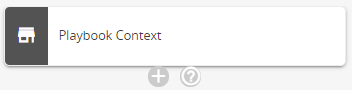
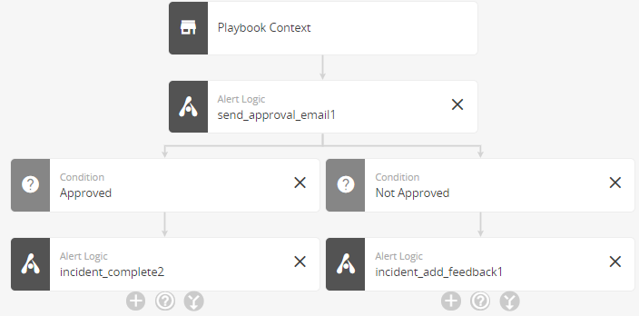
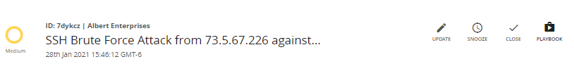

# Automated Response (Beta)

    This document is intended for early-access customers, and it is updated as Automated Response features are enhanced.     
The Automated Response page, available under **Respond** in the Alert Logic console, lists your automated response playbooks. On this page, you can create and manage playbooks and their triggers, view the playbook history, and view inquiries.

## Process to Define an Automated Response Playbook

1. [Create the playbook](#Createtheplaybook)
2. [Design the playbook workflow](#Designtheplaybookworkflow)
3. [Validate the playbook](#Validatetheplaybook)
4. [Test the playbook](#Testtheplaybook)
5. (Optional) [Specify criteria to run the playbook automatically](#Specifycriteriatoruntheplaybookautomatically)
6. (Optional) [Run the playbook on demand](#Runtheplaybookondemand)
7. View playbook run history.
See what time playbook started and ended
Granular details on the attack and the action taken
8. View inquiries.
apply to pending > take an action and respond?

## Create the playbook

1. Enter details about the playbook.
2. (Optional) Select the **Input** tab, and view the list of input parameters for this playbook. 
The playbook publishes the parameter values when it runs, and you can reference the parameters in your playbook tasks. For an incident playbook, the parametervalues are:
You can also specify additional input parameters (for example, an account identifier for an internal system).
   * **account_id**—Your Alert Logic Managed Detection and Response customer account identification number (for example, 12345678)
   * **payload_type**—Incident
   * **payload**—The payload of an Alert Logic incident. For the incident payload schema, variable descriptions, and an example, see [Incident Schema](../configure/connectors/incident.md).
4. (Optional) Select the **Variables** tab to view the list of variables for use in this playbook and their descriptions. 
Tasks in your playbooks can request these variables. The first three are the ones listed on the Input tab, followed by the payload variables described in [Incident Schema](../configure/connectors/incident.md). For more information, see Incident Playbook Variables.
5. (Optional) Select the **Result** tab  to define variables that you want to include in the overall result of your playbook. 
For each variable, enter its name and value. The value can be a default value or an expression. You can write expressions in either  [Yet Another Query Language (YAQL)](https://yaql.readthedocs.io/en/latest/) or [Jinja2](https://jinja2docs.readthedocs.io/en/stable/) format. YAQL format is <kbd>&amp;lt;% expression %&amp;gt;</kbd>. Jinja2 format is <kbd>{{ expression }}</kbd>. The result appears in the Output section of the playbook history.If a task in your playbook is to create an  Alert Logic incident in your ticketing system, a result of the task is an incident ID. You can add the variable for it on the **Result** tab to publish it not only for subsequent playbook tasks, but also for the overall playbook result. Type the variable name in the **Variable** field, for example, ticketing_incident_id. In the **Value** field, type either <kbd>&amp;lt;% ctx().ticketing_incident_id %&amp;gt;</kbd> or <kbd>{{ ctx().ticketing_incident_id }}</kbd>. The<kbd> ctx()</kbd> part of the expression publishes the variable and its value to the overall playbook result.
For each variable, enter its name and value. The value can be a default value or an expression. You can write expressions in  [Yet Another Query Language (YAQL)](https://yaql.readthedocs.io/en/latest/). The format is <kbd>&amp;lt;% expression %&amp;gt;</kbd>.The result appears in the Output section of the playbook history.If a task in your playbook is to create an  Alert Logic incident in your ticketing system, a result of the task is an incident ID. You can add the variable for it on the **Result** tab to publish it not only for subsequent playbook tasks, but also for the overall playbook result. Type the variable name in the **Variable** field, for example, ticketing_incident_id. In the **Value** field, type <kbd>&amp;lt;% ctx().ticketing_incident_id %&amp;gt;</kbd>. The<kbd> ctx()</kbd> part of the expression publishes the variable and its value to the overall playbook result.

## Design the playbook workflow

After you create the playbook, the next step is to design the playbook workflow. The workflow defines the tasks that you want the playbook to perform either on demand or  automatically when criteria are met.

Building blocks for your playbooks include the following:

* **Playbook context**—The context is the information you provided when you [create the playbook](#Createtheplaybook) and the variables available for your playbook and listed on the Variables tab.
* [Task](#Task)
* [Condition](#Condition)
* [Join](#Join)

### Task

A task is an action that you want the playbook to perform. For a list of available tasks and their descriptions, see [Playbook tasks](#Playbooktasks).

To add a task, click the add task icon () in the workflow diagram, and then enter the required information.

On the Task tab, you enter a name that becomes the key in the YAML file the playbook builds behind the scenes. .... Several options

**Delay This Task**—This option pauses carrying out a task for a fixed time in seconds. The default is 0, which means the task starts without delay. A delay is useful when you know that a task will likely fail if carried out immediately.

Suppose, for example, that a task in your playbook is to launch an instance of AWS EC2. Then the next task is to check the status. Because you know that launching AWS can take a few minutes, you  set a delay of 300 seconds (5 minutes) in the task for checking the status to allow time for the service to launch.
**Repeat This Action**—A task can repeat an action on a list of items. You select a variable that indicates the list of items to process. By default, the playbook processes all items at the same time. You can specify how many items to process simultaneously instead.

For example, suppose that you requested a list of vulnerabilities through the Alert Logic API in a previous task. Now you want to create a ticket in your external system for every vulnerability. In the task to create the tickets, you select the Repeat This Action check box. Then you select the variable published by the task that requested the list of vulnerabilities. Because  your external system places limits on how many tickets it creates at once, you specify to create 10 items  simultaneously.

Another example is a task to request that the Alert Logic Managed Web Application Firewall (WAF) block a list of attacker IP addresses. In this case, you select the Repeat This Action check box, choose the payload attacker_lset ip variable, and then choose to process the entire list at once.

Is this a barrier task

Retry

Request -

Response -

After you create a task, you can create another task for the playbook to carry out next, a parallel task, or a condition.

### Parallel task

After you create a task, an option becomes available to create a parallel task. A few examples of parallel tasks include:

* One task for the playbook to carry out if an action is approved and another task to carry out if the action is not approved
* One task for the playbook to carry out for an incident with a critical or high threat rating and another task to carry out for less severe threat ratings

One task for the playbook to carry out if the

### Join

If your playbook includes parallel tasks (such as one task for the playbook to carry out if an action is approved and another task to carry out if the action is not approved), you can create a join to specify that the playbook must wait for the parallel tasks to complete before proceeding to the next task. To add a join, click the add join icon () in the workflow diagram, and then enter required information.

If your playbook includes tasks in parallel "branches,"  multiple branches might need to transition to the same task at some point. Rather than repeat the next task in each parallel branch, you can create a join task.

You have the option to specify that the join task is a barrier, meaning that the playbook must wait for all or a specific number of tasks in the parallel branches to complete before it carries out the task. If you do not need the playbook to wait for some or all of the tasks that join into it to complete before proceeding further, the task is not a barrier, and you leave the option cleared.

This example shows a joined task that is a barrier. When this playbook triggers, an

This example shows a joined task that is not a barrier.

**To transition parallel branches to the same task and join branches:**

1. Under the last task of a branch that you want to join, click the add task icon (),  select the task that multiple branches will transition to, and then enter the required information.
2. In the other branches that you want to join, click the join to existing task icon (), and then select the task that you just added (the task that you want multiple branches to transition to).
3. If you want your new task to wait for all tasks in the previous

### Condition

A condition tells the playbook what to do if a task succeeds or fails. To add a condition, click the add condition icon () in the workflow diagram, and then enter the required information.

This example shows a task to send an approval email and the conditions added to transition to the next task. The next task depends on whether the email is approved or not.

## Validate the playbook

To ensure that your playbook has all required information, the next step is to validate it. Click the **VALIDATE** icon. A message indicates if validation is successful. If validation fails, one or more messages appear to indicate the missing information.

As you work, Alert Logic recommends that you save often as soon as you have a successful configuration. Click the **SAVE** icon to save your work and validate the playbook. The playbook does not save if the playbook is not valid.

## Test the playbook

After you validate the playbook, you can test it. This step runs the playbook with a sample incident payload. To test the playbook, click the **TEST** icon. You can then check that the playbook results are what you expected and edit your playbook as necessary.

## Specify criteria to run the playbook automatically

If you want the playbook to run automatically if certain incident criteria are met, you must specify the criteria on the Incident Notifications page. Criteria include threat levels and escalation status. For more information about setting up an incident notification, see [Incident Notifications](../configure/notifications/incident.md). In the step where you choose recipients, click **Subscribe Playbook**, and then select your playbook.

In a future release, you will be able to select criteria for running the playbook when you create the playbook instead.

## Run the playbook on demand

You can run a playbook to respond to a specific incident.

**To run the playbook on demand:**

1. In the Alert Logic console, click the navigation menu icon (), click **Respond**, and then click **Incidents**.
2. Open the incident for which to run the playbook.
3. Click the **PLAYBOOK** icon.

## Playbook tasks

The tasks support blocking attackers and disabling user accounts in an Amazon Web Services (AWS) environment.

| Vendor | Task Action | Description |
|---|---|---|
| Alert Logic | Run Alert Logic SDK Action | Run an Alert Logic SDK Python action for an [Alert Logic service](https://alertlogic-sdk-python.readthedocs.io/en/latest/). |
| Alert Logic | Send Message to Connector | Send a message or open a service ticket via a webhook or email connector. |
| Microsoft | Post Incident to Microsoft Teams Connector | Post incident details to a Microsoft Teams connector. |
| PagerDuty | Post Incident to PagerDuty Connector | Post incident details to a PagerDuty connector. |
| Slack | Post Incident to Slack Connector | Post incident details to a Slack connector. |
| ServiceNow | Create ServiceNow Incident | Open an incident in ServiceNow. |
| Alert Logic | Add Incident Feedback | Add a feedback note to an existing incident. |
| Alert Logic | Close Incident | Close an incident and provide the reason for closing the incident. |
| Alert Logic | Reopen Incident | Reopen a closed incident. |
| Alert Logic | Send Approval Request to Connector | Send an approval request to a connector, such as to a business communication application. |
| Alert Logic | Send Approval Request to User | Request approval from a user via an email or a push notification to the Alert Logic Mobile App. |
| Alert Logic | Block IPs withAlert Logic WAF | Request the Alert Logic WAF appliance to block a list of IP addresses. |
| AWS | Run AWS Action | Run any action supported by [ SDK for Python (Boto3) (AWS documentation)](https://docs.aws.amazon.com/pythonsdk/?id=docs_gateway) for an AWS service. |
| AWS | Send Event to Amazon EventBridge | Send events to Amazon EventBridge for a serverless infrastructure such as AWS Lambda. |
| AWS | Publish Message to SNS Topic | Publish a message to an Amazon Simple Notification Service (SNS) topic. |
| AWS | Disable AWS User | Disable an AWS user and its access keys. |
| AWS | AWS WAF Block IP Address - CloudFront | Block an IP address in an Amazon CloudFront web distribution integrated with the  AWS WAF  (web application firewall) service. |
| AWS | AWS WAF Block IP Address - Regional | Block an IP address in a regional AWS WAF (web application firewall). |
| AWS | AWS WAF Unblock IP Address - CloudFront | Unblock an IP address in an Amazon CloudFront web distribution integrated with the  AWS WAF (web application firewall) service. |
| AWS | AWS WAF Unblock IP Address - Regional | Unblock an IP address in a regional AWS WAF (web application firewall). |
| General Operation | Format as CSV | Format a list of JSON objects as a list of CSV strings. |
| General Operation | Send HTTP Request | Invoke  REST API to carry out HTTP requests. This action supports specifying HTTP verbs, an authorization header, custom headers, and payload. |
| General Operation | Do Nothing | Do nothing, such as while waiting for a parallel task to complete or when transitioning from one condition to another. |
| General Operation | Parse CSV | Convert a list of CSV strings to a JSON object in which the first string contains the property names and the following strings contain the values. |
| General Operation | Pause Playbook | Pause running of the playbook. |
| General Operation | Print Message | Print a message to the playbook for troubleshooting purposes. |
| General Operation | Run Remote Command | Run a remote command securely with the SSH protocol. |
| Zendesk | Create Zendesk Ticket | Create a ticket on Zendesk. |
| Zendesk | Search Zendesk Tickets | Search tickets on Zendesk. |
| Zendesk | Update Zendesk Ticket | Update a ticket on Zendesk. |
| Zendesk | Update Zendesk Ticket Status | Update the status of a Zendesk ticket. |
| ServiceNow | Create ServiceNow Record | Create a record in a ServiceNow table. |
| ServiceNow | Delete ServiceNow Record | Delete a record from a ServiceNow table. |
| ServiceNow | Get ServiceNow Records | Get records from a ServiceNow table. |
| ServiceNow | Update ServiceNow Record | Update an existing record in a ServiceNow table. |
| ServiceNow | Upload Data to ServiceNow | Upload data to a ServiceNow table as an attachment. |
