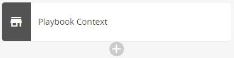

# Add a Task to a Playbook (Beta)

A task is an action that you want the playbook to perform. Instructions in this document are common to all tasks. For  task-specific configuration instructions, see the [Playbook Task Configuration Guide (Beta)](task-configuration-guide.md).

Complete the following steps to add a task to your playbook:

1. [Add a task in the workflow diagram](#Addataskintheworkflowdiagram)
2. [Add task details (optional)](#Addtaskdetailsoptional)
3. [Configure task input](#Configuretaskinput)
4. [View task results (optional)](#Viewtaskresultsoptional)
5. [Configure task output (optional)](#Configuretaskoutputoptional)

## Add a task in the workflow diagram

To add a task, click the add task icon () in the workflow diagram, and then select the task that you want to add. A status tag  appears in square brackets next to each listed task. To narrow results, you can search the list and filter it by vendor.

### Status tags

A status tag next to each task indicates its development status.

| Status Tag | Definition |
|---|---|
| alpha | Ready for testing with Alert Logic assistance. Contact Alert Logic before using. |
| beta | Tested internally and ready for customer feedback. |
| deprecated | Task that Alert Logic plans to replace or remove. |
| production | Fully tested and documented task. |

## Add task details (optional)

On the Task tab, you can enter a descriptive task name or use the default name suggested based on the action type. The Task tab also includes information about the action associated with the task. Advanced settings are optional and allow you to control when and how often to run the task or its action.

**To add task details:**

1. (Optional) On the **Task** tab, enter a descriptive task name in the **Name** field. The name is a key in the YAML file that the playbook builds as you design the workflow interactively and cannot include spaces or special characters except the underscore "_" character.
2. If you want the playbook to pause before it runs this task, select the **Delay running this task** check box, and then enter the amount of time to pause running this task in seconds.
For more information and an example, see [Delay running this task](#Delayrunningthistask).
3. If you want the task to repeat the action on a list of items, select the **Repeat the action on a list** check box, and then enter the list of item values or a YAQL expression to reference the list.
For more information and examples, see [Repeat the action on a list](#Repeattheactiononalist).
4. If this task joins parallel branches and you want it to run only once, not in each branch, select the **Add a barrier policy for a join** check box, and then:
If the check box is cleared, the task repeats in each branch with no barrier. For more information, see [link to topic or section about adding a join].
   * If you want to block this task until all previous tasks in joined parallel branches complete, click **Yes**.
   * If you want the task to run when a specified number of previous tasks completes, click **No**, and then enter the number of previous tasks that must run before this task.
6. If you want the playbook to retry a task, such as if it fails the first time, select the **Add a retry policy** check box, and then enter the following information:
For more information and examples, see [Add a retry policy](#Addaretrypolicy).
   * **Number of Retries**—Number of times to retry before the task fails
   * **Delay in Seconds**—Time (in seconds) to delay between retries
   * **When to Retry**—Condition for retrying the task as a YAQL expression

### Delay running this task

Add a delay if you expect the task to fail if the playbook runs it immediately. The default delay is zero, which means the task starts without delay, as soon as the previous task completes.

    Suppose, for example, that a task in your playbook launches an instance of AWS EC2. Then the next task is to check the status. Because you know that launching AWS can take a few minutes, you  set a delay of 300 seconds (5 minutes) in the task for checking the status. The delay allows time for the service to launch.    ### Repeat the action on a list

A task can repeat an action on a list of items. To indicate the list of items to process, you can type a list of item values or enter a YAQL expression. An expression is powerful because it can add a list dynamically, using variable information. You can click **SELECT VARIABLE** to find a variable. When you select a variable, the playbook adds it to **Items** as a YAQL expression.

Examples of typical item lists and their syntax include:

* Comma-separated list of values, which must be enclosed in square brackets: [item_1, item_2, item_3]To repeat an action on a list of specific AWS regions, select the **Repeat the action on a list** check box, and then type the list: 
<kbd>[us-east-1, us-west-2]</kbd>
* Expression that adds a list dynamically, using variable information available from previous task results that were published: `<% task(<var>task_name</var>).result.<var>published_variable_name</var> %>`Suppose that a previous task in your playbook requests a list of vulnerabilities through the Alert Logic API. Now you want the playbook to create a ticket in your external system for every vulnerability. In the task to create the tickets, you select the **Repeat the action on a list** check box, click **SELECT VARIABLE**, and then select the variable published by the previous task. When you select the variable, the playbook creates the expression in the format `<% task(<var>task_name</var>).result.<var>vulnerability_list</var> %>`, where <var>task_name</var> is a placeholder for the actual task name and *vulnerability_list* is a placeholder for the actual variable name that you selected.

* Expression that adds a list dynamically, using variable information available from the payload object: `<% ctx().<var>payload_variable_name</var> %>`Suppose that a task requests that the Alert Logic Managed Web Application Firewall (WAF) block a list of attacker IP addresses. In this case, you select the **Repeat the action on a list** check box, click **SELECT VARIABLE**, and then choose the payload attacker_lset variable. When you select the variable, the playbook creates this expression: `<% ctx().payload.attacker_lset %>`
* List that combines item values and expressions. To do this, merge the lists with the zip command, and enclose the lists in parentheses: 
<kbd>zip([<var>item_1</var>, <var>item_2</var>], &amp;lt;% <var>expression</var> %&amp;gt;)</kbd>

### Add a retry policy

You can specify that you want the playbook to retry a task that fails or meets other criteria. The YAQL expression that indicates when to retry can evaluate the status of the last action, or it can evaluate the result of the last action.

The following examples cover both scenarios:

* This YAQL expression is an example that evaluates the status of the last action: 
`<% failed() %>`Suppose that  a task is likely to fail for reasons other than misconfiguration. You decide to add a policy that retries the task three times if it fails, with a delay of five seconds between retries. To do this, you select the **Add a retry policy** check box, click **SELECT VARIABLE**, and then select **Fail** under **Task Run Status**. This selection adds the expression `<% failed() %>` to **When to Retry**.  You then enter **3** in the **Number of Retries** and **5** in **Delay in Seconds**.
* The following YAQL expressions are examples that evaluate the result of the last action:Suppose that  a cloud service that you request in your playbook, such as issuing an IP block, imposes a limit on the number of API requests that an account can pass through at one time. To overcome the rate limit, you decide to configure a policy that retries the IP block task five times if it returns error code 429, with a delay of two seconds between retries. To do this, you select the **Add a retry policy** check box, and then type `<% result().status_code = 429%>` in **When to Retry**.  You then enter **5** in the **Number of Retries** and **2** in **Delay in Seconds**.
   * `<% result().status_code = 400 %>`
   This expression indicates that you want the playbook to retry the task if the result is HTTP status code 400 (bad request).
   * `<% result().status_code != 200 %>`
   This expression indicates that you want the playbook to retry the task if the result is not HTTP status code 200 (success).
   * `<% result().status_code = 429%>`
   This expression indicates that you want the playbook to retry the task if the result is status 429 (too many requests).

If the number of retries is exceeded, the result of the last action carried out for the task determines the final task result. For example, it the action returns HTTP error 409 four times and then the last result is a 404 error, the final task result is error 404.

## Configure task input

On the **Input** tab, provide the input values for your task. Task requirements vary and often require different information. For instructions on how to configure the input for a specific task, see the [Playbook Task Configuration Guide (Beta)](task-configuration-guide.md).

Task List and Configuration Instructions
The following table lists all playbook tasks with an available configuration guide. For instructions on how to configure the input for a specific task, click a link in the Task column.

| Vendor | Task | Description |
|---|---|---|
| Alert Logic | Block IPs withAlert Logic WAF | Request the Alert Logic WAF appliance to block a list of IP addresses. |
| Alert Logic | [Close Incident](tasks/incident-close.md) | Close an incident and provide the threat assessment. |
| Alert Logic | [Reopen Incident](tasks/incident-reopen.md) | Reopen a closed incident. |
| Alert Logic | Run Alert Logic MDR Action | Run an Alert Logic MDR action for an [Alert Logic service](https://alertlogic-sdk-python.readthedocs.io/en/latest/). |
| Alert Logic | [Send Approval Request to User](tasks/send-approval-user.md) | Request approval from a user via an email or a push notification to the Alert Logic Mobile App. |
| Alert Logic | [Send Approval Request via Connection Target](tasks/send-approval-channel.md) | Send an approval request to an application via a connection target. |
| Alert Logic | [Send Incident via Connector](tasks/connector-send-incident.md) | Send incident details or create a service ticket via a webhook or email connector. |
| Alert Logic | [Update Incident](tasks/incident-update.md) | Update an incident with threat assessment feedback. |
| AWS | AWS WAF Block IP Address - CloudFront | Block an IP address in an Amazon CloudFront web distribution integrated with the  AWS WAF  (web application firewall) service. |
| AWS | AWS WAF Block IP Address - Regional | Block an IP address in a regional AWS WAF (web application firewall). |
| AWS | AWS WAF Unblock IP Address - CloudFront | Unblock an IP address in an Amazon CloudFront web distribution integrated with the  AWS WAF (web application firewall) service. |
| AWS | AWS WAF Unblock IP Address - Regional | Unblock an IP address in a regional AWS WAF (web application firewall). |
| AWS | [Disable AWS User](tasks/aws-disable-user.md) | Disable an AWS user and its access keys. |
| AWS | [Send Message to Amazon SNS Topic](tasks/amazon-sns-publish.md) | Trigger an action in AWS by sending a message. |
| AWS | Run AWS Action | Run any action supported by [ SDK for Python (Boto3) (AWS documentation)](https://docs.aws.amazon.com/pythonsdk/?id=docs_gateway) for an AWS service. |
| AWS | Send Event to Amazon EventBridge | Send events to Amazon EventBridge for a serverless infrastructure such as AWS Lambda. |
| AWS | [Update AWS WAF IP Set](tasks/aws-waf-update-ip-set.md) | Update an AWS WAF (web application firewall) IP set that controls access to a protected Amazon CloudFront distribution or regional application. |
| Microsoft | [Disable Azure AD User](tasks/azure-disable-user.md) | Disable a user in Microsoft Azure Active Directory (AD). |
| Microsoft | [Enable Azure AD User](tasks/azure-enable-user.md) | Enable a user in Azure AD. |
| Microsoft | [Send Incident to Microsoft Teams](tasks/teams-send-incident.md) | Send incident details to Microsoft Teams via a connector. |
| General Operation | Do Nothing | Do nothing, such as while waiting for a parallel task to complete or when transitioning from one condition to another. |
| General Operation | Format as CSV | Format a list of JSON objects as a list of CSV strings. |
| General Operation | Parse CSV | Convert a list of CSV strings to a JSON object in which the first string contains the property names and the following strings contain the values. |
| General Operation | Pause Playbook | Pause running of the playbook. |
| General Operation | Print Message | Print a message to the playbook for troubleshooting purposes. |
| General Operation | Run Remote Command | Run a remote command securely with the SSH protocol. |
| General Operation | Send HTTP Request | Invoke  REST API to carry out HTTP requests. This action supports specifying HTTP verbs, an authorization header, custom headers, and payload. |
| PagerDuty | [Send Incident to PagerDuty](tasks/pagerduty-send-incident.md) | Send incident details to PagerDuty via a connector. |
| ServiceNow | [Create ServiceNow Incident](tasks/servicenow-create-incident.md) | Create an incident in ServiceNow via a connector. |
| ServiceNow | Create ServiceNow Record | Create a record in a ServiceNow table. |
| ServiceNow | Delete ServiceNow Record | Delete a record from a ServiceNow table. |
| ServiceNow | Get ServiceNow Records | Get records from a ServiceNow table. |
| ServiceNow | Update ServiceNow Record | Update an existing record in a ServiceNow table. |
| ServiceNow | Upload Data to ServiceNow | Upload data to a ServiceNow table as an attachment. |
| Slack | [Send Incident to Slack](tasks/slack-send-incident.md) | Send incident details to Slack via a connector. |
| Slack | [Send Message to Slack](tasks/post-message.md) | Send a message to a Slack channel via a connection target. |
| Zendesk | Create Zendesk Ticket | Create a ticket on Zendesk. |
| Zendesk | Search Zendesk Tickets | Search tickets on Zendesk. |
| Zendesk | Update Zendesk Ticket | Update a ticket on Zendesk. |
| Zendesk | Update Zendesk Ticket Status | Update the status of a Zendesk ticket. |

## View task results (optional)

On the Results tab, you can view all results that the task generates.

If you want to make a result available as a variable for later tasks, you can publish it to the playbook context by adding it on the Output tab for the task or to the relevant task condition.

## Configure task output (optional)

This section is under development.
On the Output tab, you can view the next playbook task, if any, after you add it. You can also add current task results or other output for use in later tasks. To add output, you define a variable that later tasks can reference.

If one or more conditions follow your task, the Output tab does not appear. You add the output when you set up the condition. The playbook then publishes the output into the playbook context if the condition is met.

**To add output:**

1. Click **ADD OUTPUT**.
2. In **Variable Name**, enter a descriptive variable name. The name cannot include spaces or special characters except the underscore "_" character.
3. In **Value**, type a fixed value or enter a YAQL expression to reference a value, for example, a current task result, a playbook input  parameter, or a playbook variable. Suppose that the current task creates a ticket in Zendesk, and you want to reference the resulting ticket ID in a later task.  You name the variable Zendesk_Ticket_ID. To enter a YAQL expression that references the ticket_id variable as the value, click **SELECT VARIABLE**, and then select ticket_id under **Current Task Results**. A YAQL expression that references the value  appears in the field: `<% task(create_zendesk_ticket).result.ticket_id %>`, where "`create_zendesk_ticket`" is the current task name.
