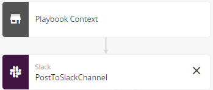
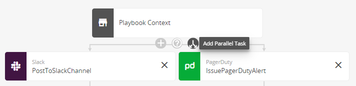
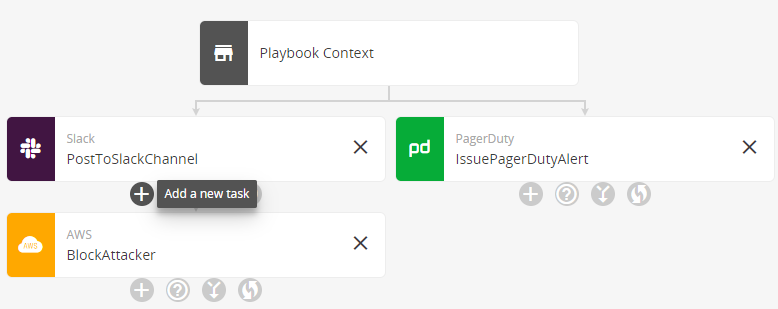
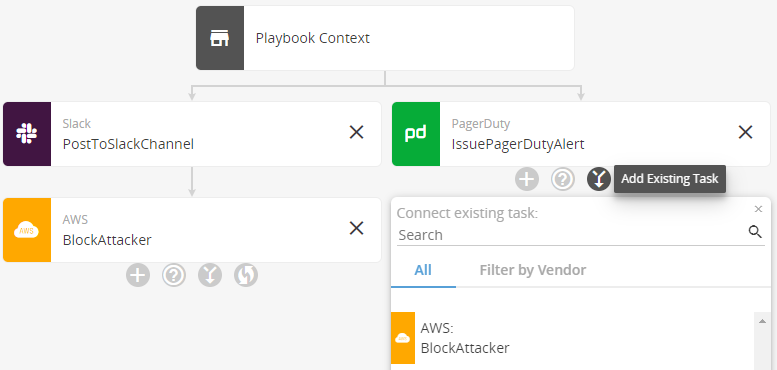
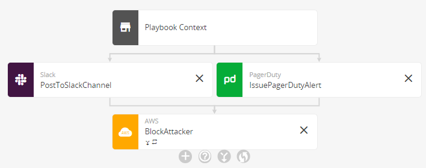

# Create a Playbook (Draft)

An automated response playbook is a predefined series of actions that can run automatically when triggered or on demand.  You can create a playbook from a template, manually, or by importing from another playbook.

## Playbook types

When you create a playbook, several choices are available:

* **Incident**—Automates actions in response to incidents that Alert Logic generates when it detects a security event. For more information about incidents, see [Incidents](../../analyze/incidents.md).
* **Observation**—Automates actions in response to an observation. You can configure a log correlation rule to generate an observation when Alert Logic detects an occurrence that matches the rule. For more information about observations, see [Correlations and Notifications](../../configure/notifications/log-correlation.md).
* **Generic**—Automates actions not triggered by an incident or observation. Generic playbooks are primarily run from other playbooks or are triggered by a schedule.

## Create a playbook from a template

## Start with a blank playbook

### Choose how to create the playbook

### Define the playbook context

In this step, you provide details about the context of the playbook.

**To define the playbook context:**

1. Enter details about the playbook.
2. (Optional) Select the **Input** tab, and view the list of input parameters for this playbook. 
The playbook publishes the parameter values when it runs, and you can reference the parameters in your playbook tasks. For an incident playbook, the parametervalues are:
You can also specify additional input parameters (for example, an account identifier for an internal system).
   * **account_id**—Your Alert LogicManaged Detection and Response customer account identification number (for example, 12345678)
   * **payload_type**—Incident
   * **payload**—The payload of an Alert Logic incident. For the incident payload schema, variable descriptions, and an example, see [Incident Schema](../../configure/connectors/incident.md).
4. (Optional) Select the **Variables** tab to view the list of variables for use in this playbook and their descriptions. 
Tasks in your playbooks can request these variables. The first three are the ones listed on the Input tab, followed by the payload variables described in [Incident Schema](../../configure/connectors/incident.md). For more information, see Incident Playbook Variables.
5. (Optional) Select the **Result** tab  to define variables that you want to include in the overall result of your playbook. 
For each variable, enter its name and value. The value can be a default value or an expression. You can write expressions in either  [Yet Another Query Language (YAQL)](https://yaql.readthedocs.io/en/latest/) or [Jinja2](https://jinja2docs.readthedocs.io/en/stable/) format. YAQL format is <kbd>&amp;lt;% expression %&amp;gt;</kbd>. Jinja2 format is <kbd>{{ expression }}</kbd>. The result appears in the Output section of the playbook history.If a task in your playbook is to create an  Alert Logic incident in your ticketing system, a result of the task is an incident ID. You can add the variable for it on the **Result** tab to publish it not only for subsequent playbook tasks, but also for the overall playbook result. Type the variable name in the **Variable** field, for example, ticketing_incident_id. In the **Value** field, type either <kbd>&amp;lt;% ctx().ticketing_incident_id %&amp;gt;</kbd> or <kbd>{{ ctx().ticketing_incident_id }}</kbd>. The<kbd> ctx()</kbd> part of the expression publishes the variable and its value to the overall playbook result.
For each variable, enter its name and value. The value can be a default value or an expression. You can write expressions in  [Yet Another Query Language (YAQL)](https://yaql.readthedocs.io/en/latest/). The format is <kbd>&amp;lt;% expression %&amp;gt;</kbd>.The result appears in the Output section of the playbook history.If a task in your playbook is to create an  Alert Logic incident in your ticketing system, a result of the task is an incident ID. You can add the variable for it on the **Result** tab to publish it not only for subsequent playbook tasks, but also for the overall playbook result. Type the variable name in the **Variable** field, for example, ticketing_incident_id. In the **Value** field, type <kbd>&amp;lt;% ctx().ticketing_incident_id %&amp;gt;</kbd>. The<kbd> ctx()</kbd> part of the expression publishes the variable and its value to the overall playbook result.

## Design the playbook workflow

After you define the playbook context, the next step is to design the workflow. The workflow defines the tasks that you want the playbook to perform either on demand or  automatically when criteria are met.

Building blocks for your playbooks include the following:

* [Playbook context](#Playbookcontext)
* [Task](#Task)
* [Condition](#Condition)
* [Join](#Join)

### Playbook context

The context includes details about the playbook that you enter when you [create the playbook](#Createtheplaybook) and the variables available for your playbook and listed on the Variables tab.

### Task

A task is an action that you want the playbook to perform and includes any policies for running it.

To add a task, click the add task icon () in the workflow diagram, and then enter the required information.

For a list of available tasks and their descriptions, see [Create a Playbook (Draft)](#Playbooktasks).

After you create a task, you can create another task for the playbook to carry out next, a parallel task, a join for parallel tasks, or a condition.

### Parallel task

After you create a task, an option becomes available to create a parallel task. A few examples  include:

* One task for the playbook to carry out for an incident with a critical or high threat rating and another for less severe threat ratings
* One set of tasks for the playbook to carry out if an action is approved and another if the action is not approved

Parallel tasks can continue in separate branches, or you can [join](#Join) them if multiple branches need to transition to the same next task.

**To add a parallel task**:

1. Click the add task icon () in the workflow diagram, select the task for the parallel branch on the left, and then enter the required information.

2. Above the added task, click the add parallel task icon (), select the parallel task for a branch to the right, and then enter the required information.

This example shows a playbook with parallel tasks that post incident details to a Slack channel and to PagerDuty.

### Join

If your playbook branches into parallel tasks, you can join the branches again. To do this, transition the tasks in the parallel branches to the same task with a join. This approach saves steps compared to repeating the configuration for the next task in each branch.

You can specify that the task that joins the branches is a barrier, meaning that the playbook must wait for all or a specified number of tasks in the parallel branches to complete before it carries out the join task and proceeds to subsequent tasks. If you leave the option to add a barrier policy cleared, the playbook repeats the joined task in each branch.

**To join branches:**

1. Under the last task of a branch that you want to join with another branch, click the add task icon (),  select the task for the branches to transition to, and then enter the required information to configure the task. 

2. In the branch that you want to join, click the join to existing task icon (), and then select the task that you just added, BlockAttacker in the following example.

After you select the existing task, the branches join.

3. If the playbook needs to run the join task only once and wait for previous tasks in the joined branches to complete before carrying out the action, on the **Task** tab, select the **Add a barrier policy for a join** check box, and then do one of the following:
In the case with the parallel tasks PostToSlackChannel and IssuePagerDutyAlert that transition to BlockAttacker:
   * If you leave the **Add a barrier policy for a join** check box cleared, the playbook runs the BlockAttacker task twice, once after the PostToSlackChannel completes and once after the IssuePagerDutyAlert task completes.
   * If you select the **Add a barrier policy for a join** check box, and then click **Yes**, both tasks must complete before the playbook runs the BlockAttacker task.
   * If you select the **Add a barrier policy for a join** check box, click **No**, and then enter **1**, the playbook runs the BlockAttacker task once, as soon as either previous task completes.
   * If the playbook must wait for all previous tasks in joined branches to complete, click **Yes**.
   * If only some of the tasks must complete in joined branches, click **No**, and then enter the number of previous tasks that must complete  before the playbook proceeds with this task.

### Condition

A condition tells the playbook how to proceed depending on different outcomes such as task success or failure. To add a condition, click the add condition icon () in the workflow diagram, and then enter the required information.

This example shows a task to send an approval email and the conditions added to transition to the next task. The next task depends on whether the email is approved or not.

